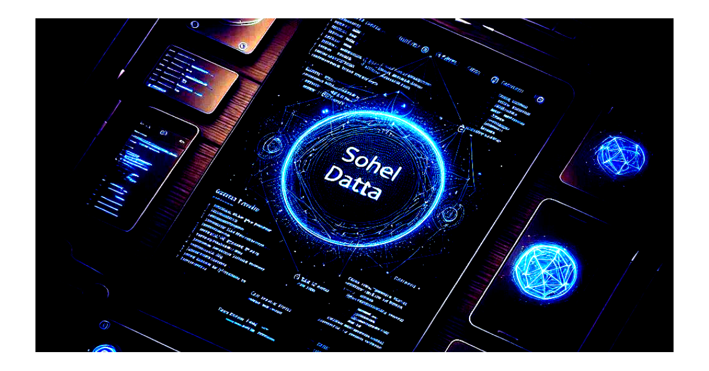

# 💫 About Me:
Hey there, I'm Sohel Datta, a Developer on a journey to master programming for crafting exceptional user interfaces.

---

# 🔗 My Portfolio:

---

# ⚠️ Repository Information:
Most of my repositories are private. 🔒

---

# 🚀 Hackathon Highlights
  
**SMART BENGAL HACKATHON (RCC IIT, Kolkata)**  
**May 2024** 

- Participated in the Smart Bengal Hackathon organized by RCC IIT, Kolkata.
- Our team, NovaByte, secured 2nd place in the hackathon.

---
**STATUSCODE2 (IISER, Kalyani)**  
**August 2025** 

- Participated in the STATUSCODE2 organized by IIIT KAlyani in collaboration with IISER, Kolkata.
- Our team, String Theory, secured 3rd place in the hackathon.

---

# 🛠️ Open Source Contributor & Maintainer

- **SWOC'24:**
  - Contributed to open source projects, embracing the spirit of collaborative coding.

- **GSOC'24:**
  - Continued my open source journey by actively participating and contributing in the Winter of Code.

---

# 🌐 Socials:
 
 

---

# 💻 Tech Stack:
 
 
 
 
 
 
 
 
 
 
 
 
 
 

---

# 📈 GitHub Stats

---

# Badges 🏅🎖️

---

# Certificates 📜🎓

---

### ✍️ Random Dev Quote

